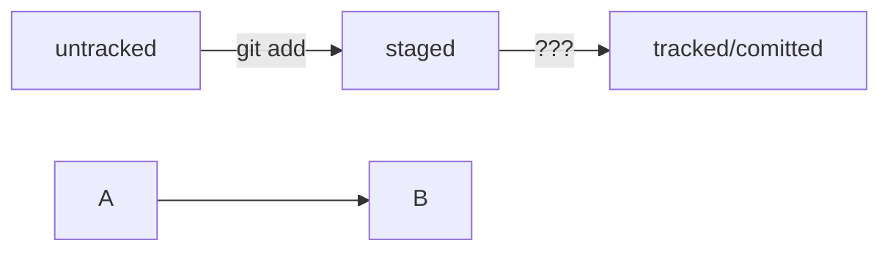

# Сдесь будет основная информация по ГИТ(GIT)

### 1.[Команды](## Команды)

### 2.[Работа с консолью](Работа с консолью)

### 3. [Как и что делать](Как пользоваться ГИТ)

---

## Команды

### Здесь будут представлены команды связанные с GIT

**git remote** add "Имя репозитория" "ССЫЛКА НА SSH"

**git clone** - скачать репозиторий

**git add** - обновить файлы

**git comit** - добавить коммит

##Работа с консолью

cd - _выбрать директорию_

ls - _посмотреть вложения в директории_

pwd - _посмотреть где ты находишься_

touch - _создать файл_

mkdir - _создать папку_

mv(dir) - _перемешение_

rm - _удаление_

*rm -r "имя папки" - удаление папки*

##Как пользоваться ГИТ

В гите используется **Log** для отслеживания хэша изменений . Последний хэш в гит маркируется как **HEAD**. Так же через ***git log***
Есть 4 статуса изменения . **Untracked**(может быть только 1 и нечего более) ,**Stage**(подготовлен. Используется с modified и trackable)
**Tracked**(Отслеживается.), **Modified** (изменен).
Все статусы файлов можно отследить через команду ***git status***

