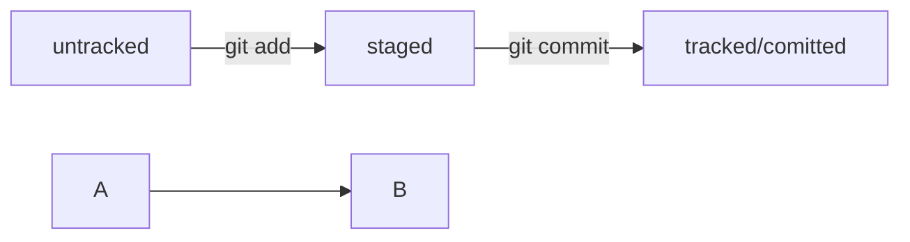

# Сдесь будет основная информация по ГИТ(GIT)

### 1.[Команды](## Команды)

### 2.[Работа с консолью](Работа с консолью)

### 3. [Как и что делать](Как пользоваться ГИТ)

---

## Команды

### Здесь будут представлены команды связанные с GIT

**git remote** add "Имя репозитория" "ССЫЛКА НА SSH"

**git clone** - скачать репозиторий

**git add** - обновить файлы

**git comit** - добавить коммит

## Работа с консолью

cd - _выбрать директорию_

ls - _посмотреть вложения в директории_

pwd - _посмотреть где ты находишься_

touch - _создать файл_

mkdir - _создать папку_

mv(dir) - _перемешение_

rm - _удаление_

*rm -r "имя папки" - удаление папки*

## Как пользоваться ГИТ

В гите используется **Log** для отслеживания хэша изменений . Последний хэш в гит маркируется как **HEAD**. Так же через ***git log***
Есть 4 статуса изменения . **Untracked**(может быть только 1 и нечего более) ,**Stage**(подготовлен. Используется с modified и trackable)
**Tracked**(Отслеживается.), **Modified** (изменен).
Все статусы файлов можно отследить через команду ***git status***

## Просмотр информации о коммитах

**git log** (от англ. log, «журнал [записей]») — выведи подробную историю коммитов;
**git log --oneline**(от англ. log, «журнал [записей]» + one line, «одной строкой») — покажи краткую информацию о коммитах: сокращённый хеш и сообщение.

#Просмотр состояния файлов

**git status**(от англ. status, «статус», «состояние») — покажи текущее состояние репозитория.

## Добавление изменений в последний коммит

**git commit --amend --no-edit** (от англ. amend, «исправить») — добавь изменения к последнему коммиту и оставь сообщение прежним;
**git commit --amend -m "Новое сообщение" **— измени сообщение к последнему коммиту на Новое сообщение.
💡 Выйти из редактора Vim: нажать Esc, ввести :qa!, нажать Enter.

## «Откат» файлов и коммитов

**git restore --staged hello.txt **(от англ. restore, «восстановить») — переведи файл hello.txt из состояния staged обратно в untracked или modified;
**git restore hello.txt **— верни файл hello.txt к последней версии, которая была сохранена через git commit или git add;
**git reset --hard b576d89** (от англ. reset, «сброс», «обнуление» + hard, «суровый») — удали все незакоммиченные изменения из staging и «рабочей зоны» вплоть до указанного коммита.

## Просмотр изменений

**git diff ** (от англ. difference, «отличие», «разница») — покажи изменения в «рабочей зоне», то есть в modified-файлах;
**git diff a9928ab 11bada1 **— выведи разницу между двумя коммитами;
**git diff --staged **— покажи изменения, которые добавлены в staged-файлах.
Эти команды помогут вам мастерски управлять коммитами: просматривать нужную информацию о них, вносить в них изменения, сравнивать и даже возвращаться назад во времени. Всё благодаря магии Git!
А теперь самое время переместиться в следующую тему — в ней вас ждёт ещё больше новых знаний о системе контроля версий.

